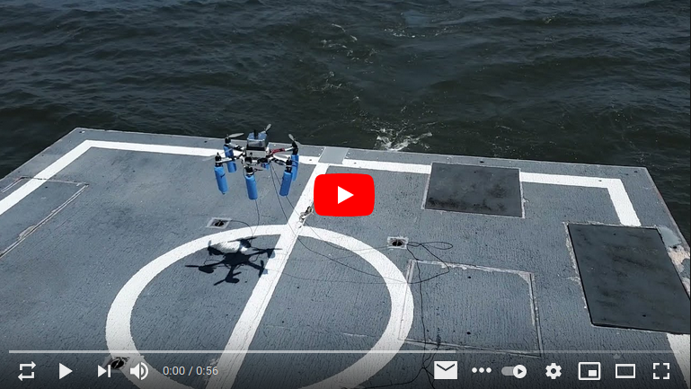
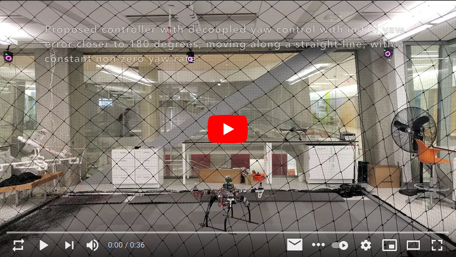
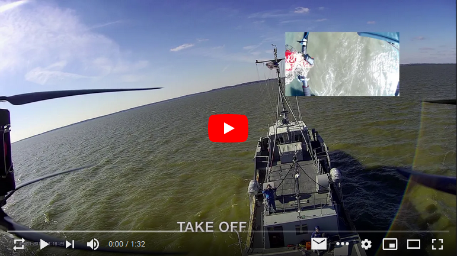
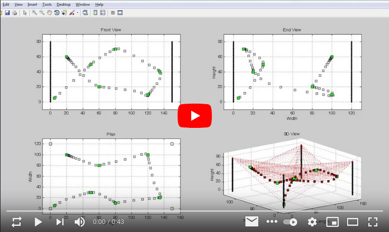
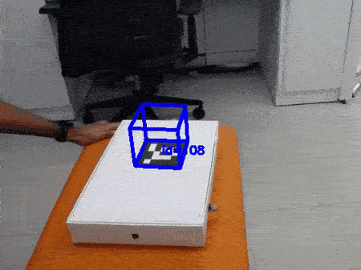
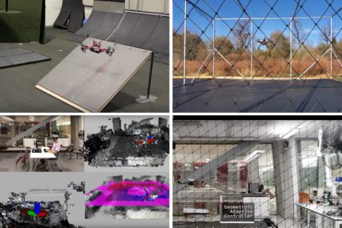
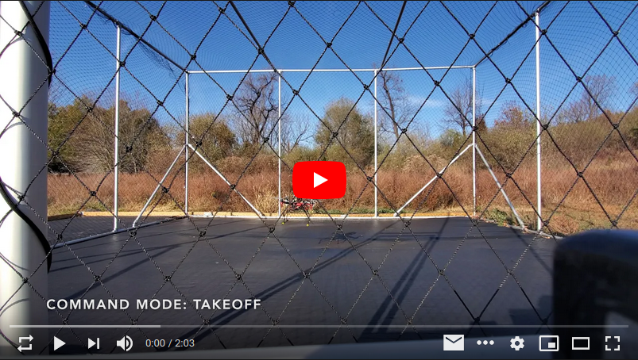

I am a current PhD candidate at the [Flight Dynamics and Control Lab](http://www2.seas.gwu.edu/~tylee/), at the George Washington University, expecting to graduate soon. 

I received my master's degree at the George Washington University in Mechanical and Aerospace Engineering, specializing in robotics and control, before starting the PhD program.
I completed my bachelor's degree in Mechanical Engineering at the University of Peradeniya, Sri Lanka. 

## Contents
* [Projects](#projects)
* [Open-Source Contributions](#open-source-contributions)
* [Publications](#publications)

## Projects
### Autonomous Landing of a UAV on a Moving Ship

{:target="_blank"}

I developed a UAV and its estimator/controller system for autonomous landing of a UAV on a moving ship, which includes estimating and compensating for the disturbances incurred by the ship's air wake. 
Further, after noticing that there is a delay in GPS position measurement, I augmented the estimator to forward propagate the delayed measurements to the correct time horizon using IMU measurements. 
All these improvements have been tested in a successful autonomous landing of a UAV on a US Naval Academy research vessel at Chesapeake bay.

**Features**
* Jetson TX2 as the onboard computer
* In-house developed multi-threaded C++ code
* In-house developed geometric decoupled-yaw controller [[paper](https://doi.org/10.23919/ACC.2019.8815189)]
* In-house developed delayed Kalman filter as the estimator [[paper](https://doi.org/10.1109/TAES.2021.3061795)]
* Sensors: IMU - VN100; GPS - SwiftNav Piksi Multi
* Custom designed PCB for voltage regulation, sensor/ESC communication with the TX2
* TCP/IP connection through Wi-Fi for UAV communication for sending commands/real-time data monitoring
* Water-tight encloser for the components
* Thermal solution for removing heat from the encloser

### Decoupled-Yaw Geometric Controllers for Unmanned Aerial Vehicles
{:target="_blank"}

I developed a geometric control algorithm to reduce the trajectory errors when an unmanned aerial vehicle (UAV) follows a path with large yaw angle rotations, such as scanning an area for mapping. 
The decoupling of yaw significantly reduced the error, and its efficacy has demonstrated by autonomous UAV flight tests in both indoor (using motion capture) and outdoor (with GPS positioning) settings.
This has been further augmented to include an adaptive controller, making the UAV control more robust in heavy disturbances such as strong wind.

**Features**
* Same custom-developed hardware/software system as the UAV used in [Autonomous Landing](#autonomous-landing-of-a-uav-on-a-moving-ship) project
* Use Vicon motion capture system for position data
* TCP/IP connection through Wi-Fi for UAV communication for sending commands/real-time data monitoring

### Ship Air-Wake Detection Using Unmanned Aerial Vehicles 
{:target="_blank"}

I have developed several hardware and software systems to detect ship air-wake of a ship using unmanned aerial vehicles (UAVs) as a collaboration between GWU and US Naval Academy. 
This includes a data package to measure the wind speed behind a ship using an octocopter and a fixed-wing aircraft. 
The data package can measure the relative position of the UAV relative to the ship up to 2 cm accuracy, and includes a telemetry/software system for real time monitoring. 
The data has been collected using US Naval Academy research vessel YP 700 at Chesapeake Bay.

**Features**
* Raspberry-Pi as the onboard computer
* Arduino-based system for reading and logging pilot RC commands
* In-house developed multi-threaded Python code
* In-house developed Kalman filter for sensor fusion [[paper](https://doi.org/10.2514/6.2019-2377)]
* Sensors: Anemomters - AT Type A, Anemoment TriSonica Mini; IMU - VN100; GPS - SwiftNav Piksi Multi
* Custom designed PCB for voltage regulation, sensor communication with the Raspberry-Pi
* TCP/IP connection through Wi-Fi for UAV communication for sending commands/real-time data monitoring
* Water-tight encloser for the components
* Real-time data monitoring and plotting on the base laptop

### Implementing an Intrinsic Nonlinear PID Controller

{:target="_blank"}

As my undergraduate year-long group project, my group-mates and I developed hardware/software system for controlling a quadrotor UAV using an almost-globallly stable geomtric attitude controller with a large region of stability.
The project was completed satisfactorily winning the The Professor E.F. Bartholomeusz Prize for the best final year project at the University of Peradeniya.

**Features**
* Multi-Wii as the onboard computer
* In-house developed controller for UAV control [[paper](https://doi.org/10.1109/ICIINFS.2015.7399049)]
* Platform independent simulator with real-time data monitoring

### Mathematical Modelling, Simulation and Control of a SpiderCam System
{:target="_blank"}

Spider Cam is a camera which can move over a pre-determined 3 dimensional space, where the dynamics are determined by cables fixed to the camera. 
By varying the tensions of the cables, the motion of the camera can be varied. The system was mathematically modeled considering the rigid body motion of the camera and sagging of the cables, designed the controller and also developed a way-point tracking controller. 
Considering the entire system, system has been mathematically modelled and has been simulated using MATLAB.

[back to contents](#contents)

## Open-Source Contributions

A selcted set of open-source repositories where I am the main contributor and maintainer. 
For most up-to-date details please visit [my GitHub page](https://github.com/kanishkegb).

### Working examples/tutorial for detection and pose estimation of ArUco markers with C++: [fdcl-gwu/aruco-markers](https://github.com/fdcl-gwu/aruco-markers)

This is a side project that resulted from the work published in my paper “Attitude observer on SO (3) with time-varying reference directions”. 
This repository provides C++ codes for basic augmented reality related tasks using computer vision. 
In fact, this is usually withing the first three Google results when you search for ArUco markers using C++.

### Geometric controllers developed at FDCL for UAVs : [fdcl-gwu/uav_geometric_control](https://github.com/fdcl-gwu/uav_geometric_control)

This repository includes the controller proposed in “Geometric controls of a quadrotor UAV with decoupled yaw control”.
In addition, this includes both coupled-yaw and decoupled-yaw controllers in Matlab, Python, and C++ for any interested person to use in their projects.

### Python - Gazebo simulation environment for a UAV with geometric control: [fdcl-gwu/uav_simulator](https://github.com/fdcl-gwu/uav_simulator)

This is another output of the work published in “Geometric controls of a quadrotor UAV with decoupled yaw control”. 
This includes a complete framework for simulating a UAV, which includes controller, estimator, using an open-source physics engine.

### Comparison of delayed Kalman filters, with application to the state estimation of a UAV: [fdcl-gwu/dkf-comparison](https://github.com/fdcl-gwu/dkf-comparison)

{:target="_blank"}

This work includes the results published in “Quadrotor State Estimation with IMU and Delayed Real-time Kinematic GPS”, which compares different delayed Kalman filters for their performances.

[back to contents](#contents)

## Publications

Below is my current published research work.
For most up-to-date version, please visit my [Google Scholar page](https://scholar.google.com/citations?user=iLvJAuEAAAAJ&hl=en).

* Geometric Adaptive controls of a quadrotor UAV with decoupled attitude dynamics, K Gamagedara, T Lee, DOI: [10.1115/1.4052714](https://doi.org/10.1115/1.4052714){:target="_blank"}
* Quadrotor state estimation with IMU and delayed real-time kinematic GPS, K Gamagedara, T Lee, M Snyder, IEEE Transactions on Aerospace and Electronic Systems, 2021, DOI: [10.1109/TAES.2021.3061795](https://doi.org/10.1109/TAES.2021.3061795){:target="_blank"}
* In situ detection and analysis of ship air wakes from a US Navy research vessel, MR Snyder, K Gamagedara, T Lee, JA Pritchard, AIAA Aviation Forum, 2021, DOI: [10.2514/6.2021-2485](https://doi.org/10.2514/6.2021-2485){:target="_blank"}
* Unscented Kalman filter for INS/GNSS data fusion with time delay, K Gamagedara, T Lee, MR Snyder, AIAA Aviation Forum, 2021, DOI: [10.2514/6.2021-2486](https://doi.org/10.2514/6.2021-2486){:target="_blank"}
* Geometric control and experimental validation for a quadrotor UAV transporting a payload, B Yu, K Gamagedara, S Kim, T Lee, J Suk, 59th IEEE Conference on Decision and Control (CDC), 2020, DOI: [10.1109/CDC42340.2020.9303889](https://doi.org/10.1109/CDC42340.2020.9303889){:target="_blank"}
* On the observability of attitude with single direction measurements, W Wang, K Gamagedara, T Lee, preprint arXiv:2008.13067, 2020, arXiv: [2008.13067](https://arxiv.org/abs/2008.13067){:target="_blank"}
* Geometric controls of a quadrotor UAV with decoupled yaw control, K Gamagedara, M Bisheban, E Kaufman, T Lee, American Control Conference (ACC), 2019, DOI: [10.23919/ACC.2019.8815189](https://doi.org/10.23919/ACC.2019.8815189){:target="_blank"}
* Attitude observer on SO (3) with time-varying reference directions, K Gamagedara, T Lee, DE Chang, 18th European Control Conference (ECC), 2019, DOI: [10.23919/ECC.2019.8796126](https://doi.org/10.23919/ECC.2019.8796126){:target="_blank"}
* Real-time kinematics GPS based telemetry system for airborne measurements of ship air wake, K Gamagedara, T Lee, MR Snyder, AIAA Scitech Forum, 2019, DOI: [10.2514/6.2019-2377](https://doi.org/10.2514/6.2019-2377){:target="_blank"}
* Studies on autonomous landing of an unmanned aerial vehicle on a moving ship, AE Robaglia, S Libine, K Gamagedara, K Takami, MR Snyder, T Lee, AIAA Information Systems - AIAA Infotech@ Aerospace, 2018, DOI: [10.2514/6.2018-1461](https://doi.org/10.2514/6.2018-1461){:target="_blank"}
* Ship air wake detection using small fixed wing unmanned aerial vehicle, D Phelps, K Gamagedara, J Waldron, K Patil, M Snyder, AIAA Aerospace Sciences Meeting, 2018, DOI: [10.2514/6.2018-0784](https://doi.org/10.2514/6.2018-0784){:target="_blank"}
* Vision-based relative localization for airborne measurements of ship air wake, K Gamagedara, K Patil, T Lee, MR Snyder, AIAA Atmospheric Flight Mechanics Conference, 2018, DOI: [10.2514/6.2018-0527](https://doi.org/10.2514/6.2018-0527){:target="_blank"}
* Measurements of ship air wake using airborne anemometers, CJ Mallon, BJ Muthig, K Gamagedara, K Patil, C Friedman, T Lee, MR Snyder, 55th AIAA Aerospace Sciences Meeting, 2017, DOI: [10.2514/6.2017-0252](https://doi.org/10.2514/6.2017-0252){:target="_blank"}
* Implementation of an almost globally stable intrinsic nonlinear pid controller for attitude stabilization of a quadrotor, J Somasiri, K Gamagedara, DHS Maithripala, JM Berg, IEEE 10th International Conference on Industrial and Information Systems, 2015, DOI: [10.1109/ICIINFS.2015.7399049](https://doi.org/10.1109/ICIINFS.2015.7399049){:target="_blank"}

[back to contents](#contents)
